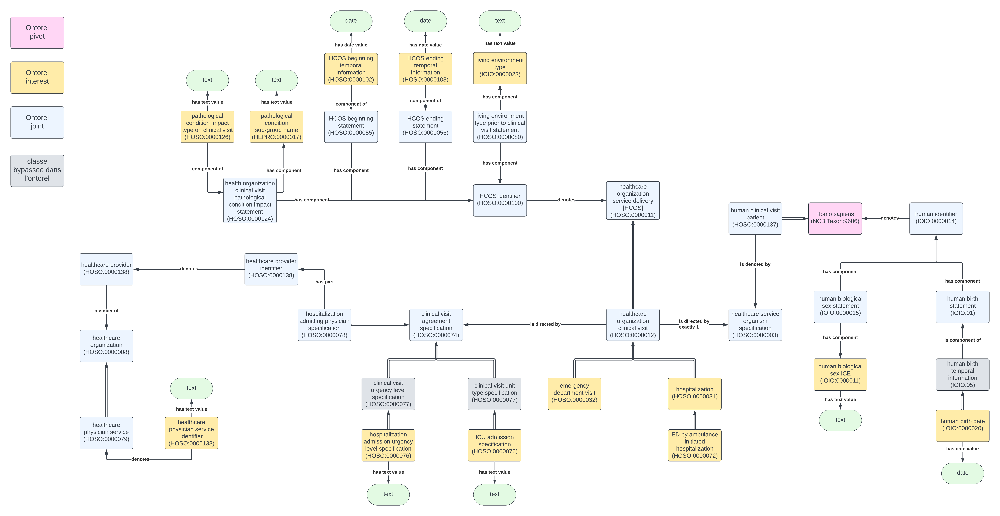

# MPHPO Ontology Documentation

[//]: # "This file is meant to be edited by the ontology maintainer."

Welcome to the MPHPO documentation!

You can find descriptions of the standard ontology engineering workflows [here](odk-workflows/index.md).

## Ontorel schema

## Ontorel Classes 

{{ read_csv('../src/ontology/reports/ontorel-classes-list-report.csv') }}